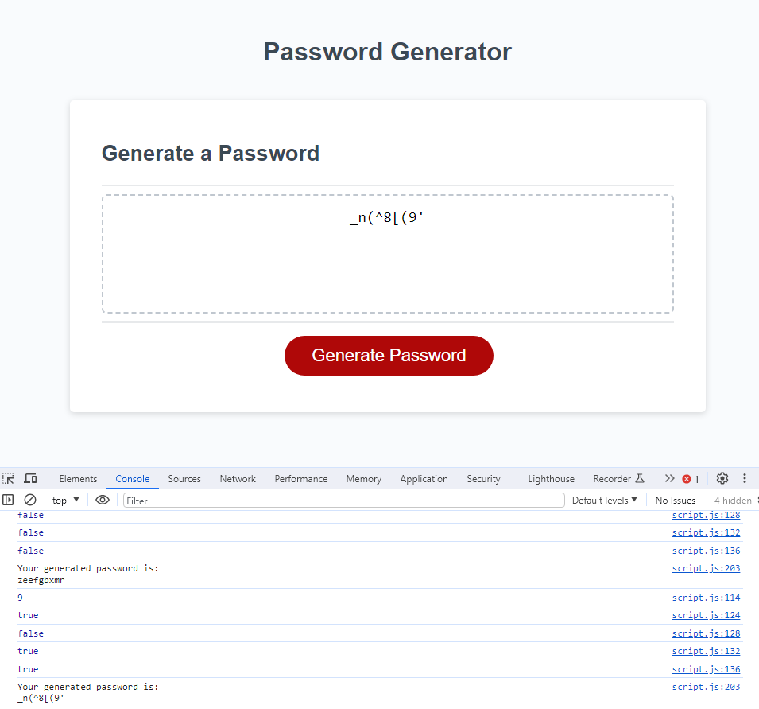

# Password-Generator

## Description

This application allows users to generate secure passwords by selecting various criteria, including password length and character types (lowercase, uppercase, numeric, and special characters). The generated password is then displayed in an alert. 

The application runs in the browser and features dynamically updated HTML and CSS powered by JavaScript.

## Tasks Completed

Successfully executed the following tasks using JavaScript:

- Implemented a password generator that generates a password when the button is clicked.
- Presented a series of prompts for password criteria, including length and character types.
  - Length is validated to be at least 8 characters but no more than 128.
  - Character types include lowercase, uppercase, numeric, and special characters.
- Validated each input to ensure accurate and secure password generation.
- Ensured at least one character type is selected before generating a password.
- Displayed the generated password in an alert for user convenience.
- Deployed the application, making it accessible for password generation.
- Maintained a clean and polished user interface for an intuitive experience.
- Followed best practices for file structure, naming conventions, and code quality.
- Provided a comprehensive README with project details, live application link, and GitHub repository information.
- Included screenshots to visually represent the generated password.
- Encouraged exploration of the codebase and generator results.

Feel free to explore the codebase and experiment with the password generator to create secure and tailored passwords.

## Screenshot

*The image above captures an example of a generated password.*

## Deployment

This project is deployed and accessible at the following URLs:

- [Live Application](https://deponte-designer.github.io/Password-Generator): Click this link to generate passwords.
- [GitHub Repository](https://github.com/deponte-designer/Password-Generator): Visit the repository for project details, including a comprehensive README.

> Dive into the code and explore the results of the password generator! Feel free to experiment and generate unique passwords tailored to your needs.

## License

Copyright (c) 2023 [dePonte](https://github.com/deponte-designer)

Permission is hereby granted, free of charge, to any person obtaining a copy of this software and associated documentation files (the "Software"), to deal in the Software without restriction, including without limitation the rights to use, copy, modify, merge, publish, distribute, sublicense, and/or sell copies of the Software, and to permit persons to whom the Software is furnished to do so, subject to the following conditions:

The above copyright notice and this permission notice shall be included in all copies or substantial portions of the Software.

THE SOFTWARE IS PROVIDED "AS IS", WITHOUT WARRANTY OF ANY KIND, EXPRESS OR IMPLIED, INCLUDING BUT NOT LIMITED TO THE WARRANTIES OF MERCHANTABILITY, FITNESS FOR A PARTICULAR PURPOSE AND NONINFRINGEMENT. IN NO EVENT SHALL THE AUTHORS OR COPYRIGHT HOLDERS BE LIABLE FOR ANY CLAIM, DAMAGES OR OTHER LIABILITY, WHETHER IN AN ACTION OF CONTRACT, TORT OR OTHERWISE, ARISING FROM, OUT OF OR IN CONNECTION WITH THE SOFTWARE OR THE USE OR OTHER DEALINGS IN THE SOFTWARE.

## Badges

